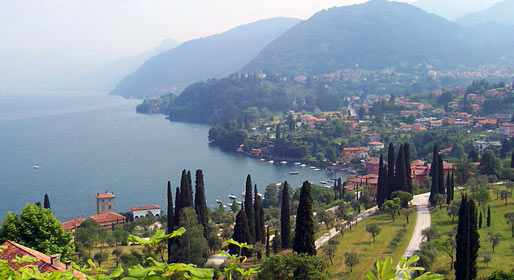

The [Modelica Association](https://modelica.org) and [Politecnico di Milano](http://www.polimi.it/) organized the 7th International Modelica Conference at the Grand Hotel di Como, Como, Italy, on **September 20-22, 2009**.



# Fact and figures about the conference

* **Keynote talks** were given by representatives from **Dassault Systèmes**, **Daimler**, and **Siemens**, about the ITEA2 European Modelica-related research projects **EUROSYSLIB**, **MODELISAR**, and **OPENPROD**, which are boosting the application of the Modelica language in the industry as a standard tool for system design and verification.
* **219 registered participants** attended the conference. **105 technical papers** were presented, 83 in regular sessions and 22 in the poster session. All technical papers are available in the online [Proceedings](proceedings/index.html).
* 5 Tutorials were offered, ranging from introductory presentations of the Modelica language to more advanced topics such as optimization. Click here for more information.
* **9 Modelica-enabled tools** were presented in the Tool presentation sessions. The Modelica language is well on his way to become the industry standard for engineering system modelling and simulation.
* [13 Exhibitors](proceedings/pages/exhibitors.html) showed Modelica-related software and services throughout the conference duration.

# Conference Proceedings

The conference program, book of abstracts and other information are available here:

* Proceedings [(intro)](proceedings/index.html) [(LiU E-Press)](http://www.ep.liu.se/ecp/043) [(zip)](https://github.com/modelica/ModelicaConference2009/releases/download/USB/Modelica2009.zip)
  * [Sunday](proceedings/pages/MODEL09_ContentListWeb_1.html)
  * [Monday](proceedings/pages/MODEL09_ContentListWeb_2.html)
  * [Tuesday](proceedings/pages/MODEL09_ContentListWeb_3.html)
* [Modelica Libraries](proceedings/pages/libraries.md)
* [Programme Committee](organization.md)

The full bibliographic reference is:

```
Proceedings of the 7th International Modelica Conference.
Como, Italy, 20-22 September 2009.
Francesco Casella, editor.
Linköping University Electronic Press, 2009.
ISBN 978-91-7393-513-5.
Linköping Electronic Conference Proceedings, ISSN:1650-3740.
```

DOI: [10.3384/ecp0943](http://dx.doi.org/10.3384/ecp0943)<br />
*Each single paper is also referenced by an individual DOI identifier, which is stamped on bottom of the first page.*
